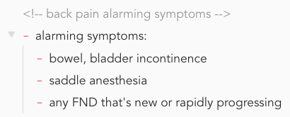
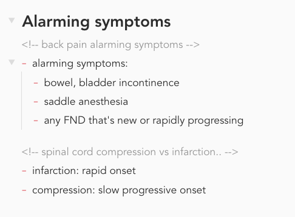

# Making Cards

## Using Html Comments

Original Ankify used `{{}}` to define the front of the card. I found this leaves the front of the card visible when rendered to html:

- Left: editor mode; right: rendered mode

In the current version of Anki, html comment`<-- -->`is used as card front. The front of the card disappears on rendering to html. This is especially useful when publishing notes online:

- Left: editor mode; right: rendered mode showing html comments not visible

## Simple Card

In any note, make a card using html comment `<!-- -->` notation. The content inside `<!-- -->` will become the front of the anki card on rendering. The content following the comment will become the back of the card. 

Anki uses first field to check for duplicates, which is what's inside  `<!-- -->`. If you change the text inside the comment, Anki will import a new card instead. On the other hand, if you change the content after the comment, Anki will update the card instead

## Notes Without a Card

Notes without any cards will be ignored. 

## Multiple Cards in a Note

To have multiple cards in a note, simply add more `<-- -->` blocks. The content of each cards ends once a new card begins. For example, the following note will render two cards:

## Exclude Contents in a Note

Sometimes you want to exclude parts of the note from being made into a card. I use a ignore card to make this happen. In the following example, only the first and third cards are made:

This is because of first field match that Anki uses. If you have multiple ignore cards, Anki will use the last one instead of importing multiple.

